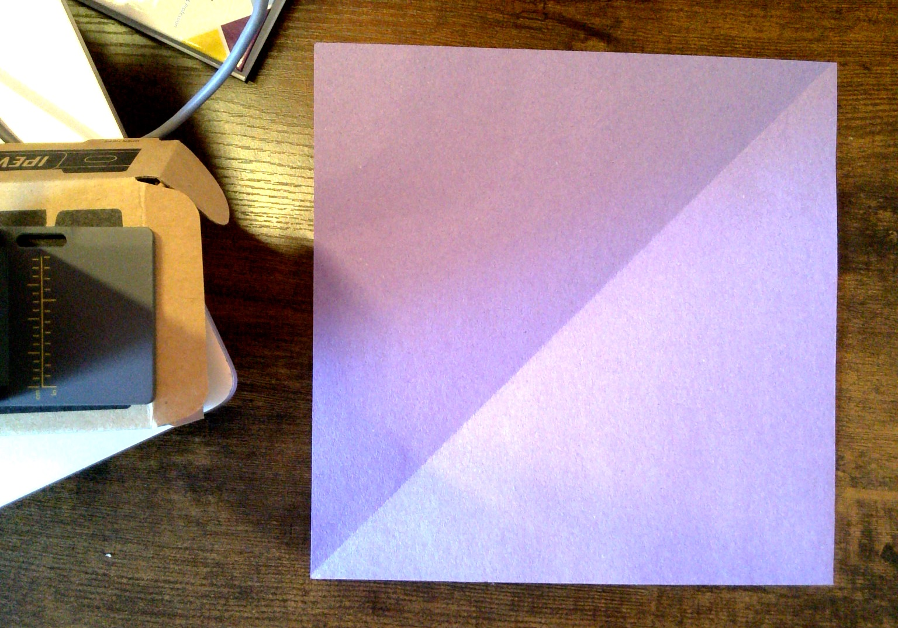
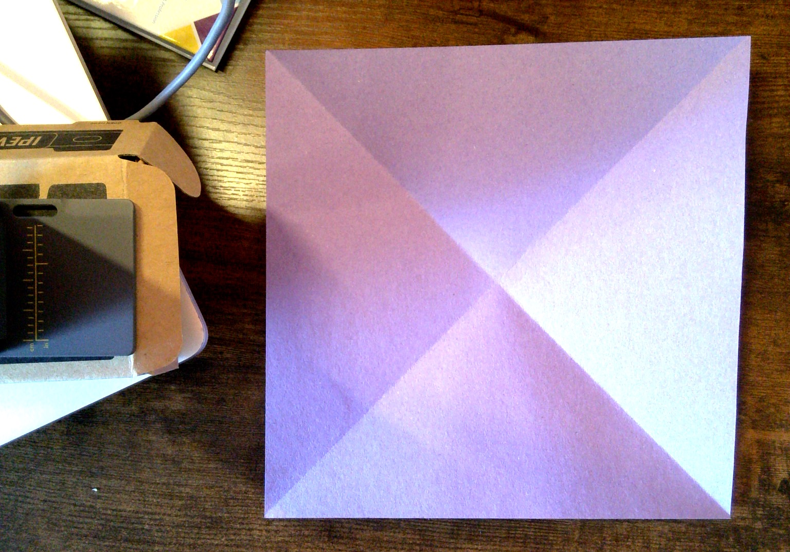
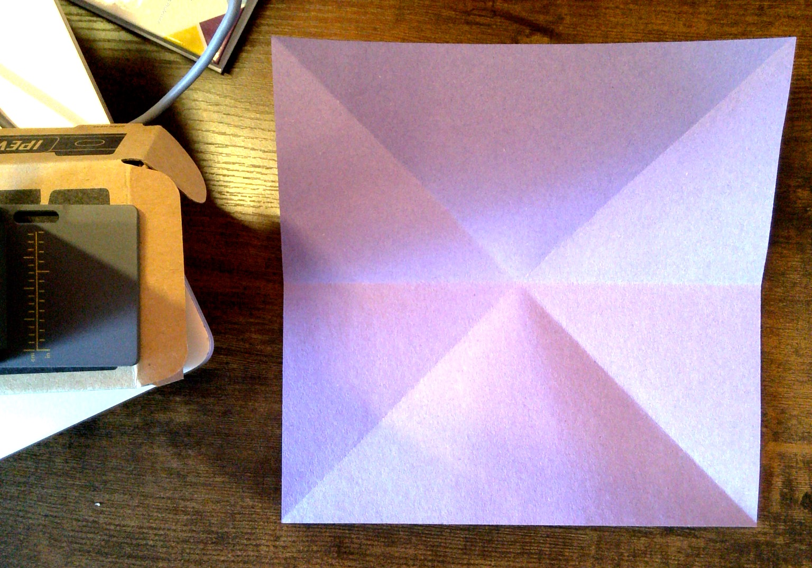
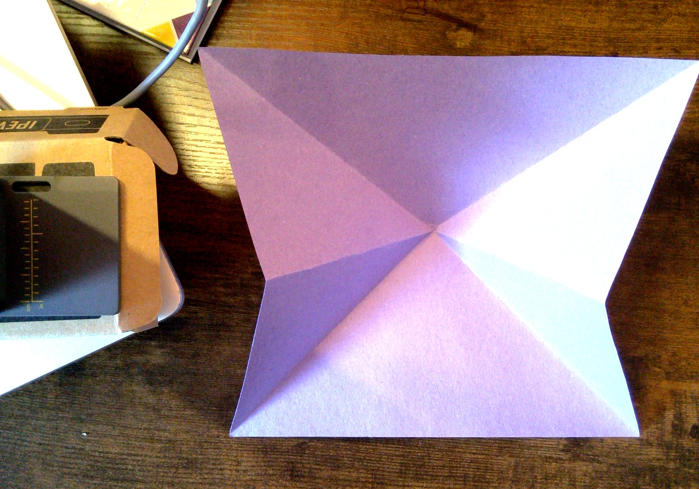
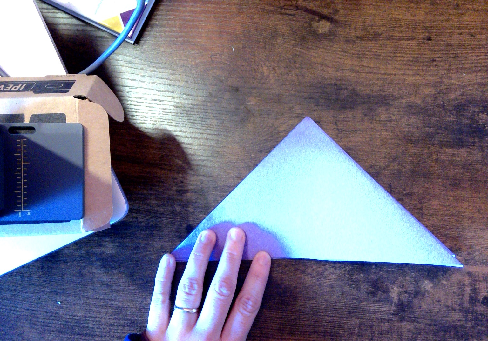
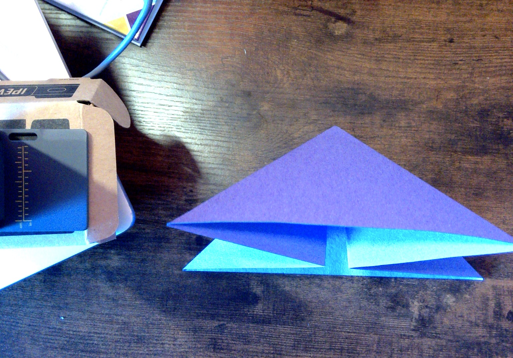
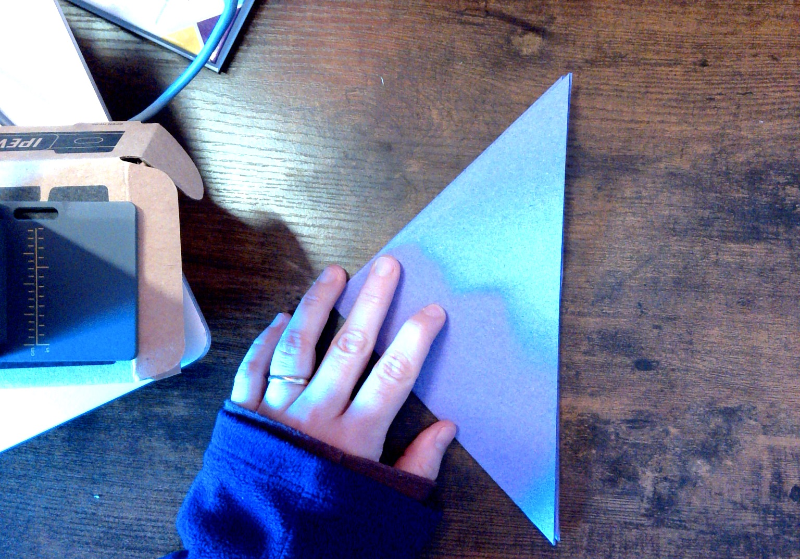
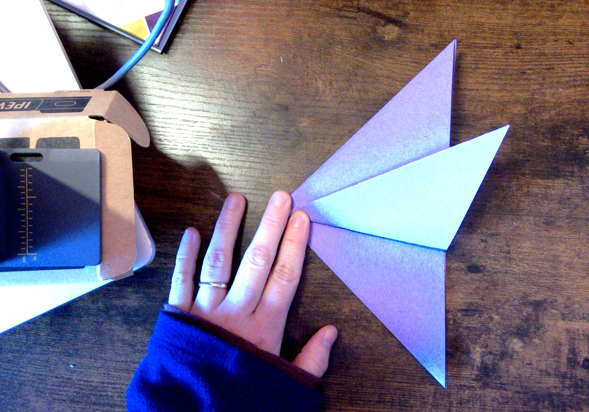
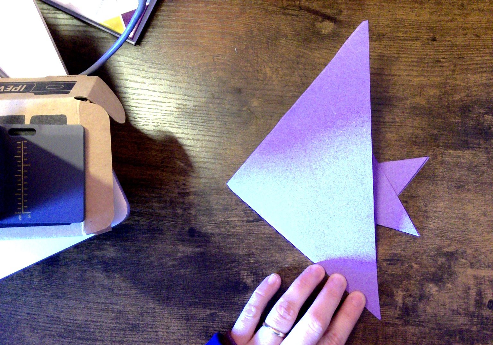
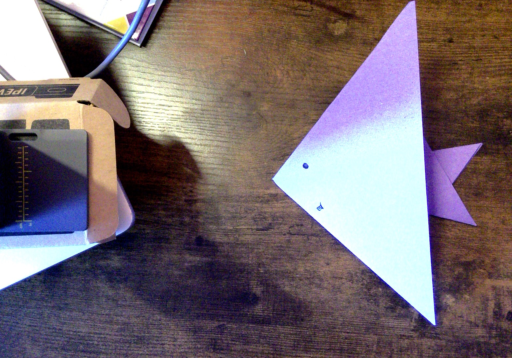

# Origami Fish!

Here are step-by-step instructions to make a simple origami fish:

### Materials Needed:
* Square origami paper (you can use colored or patterned paper for 
a more decorative fish)
* Flat surface

### Steps:
Start with the paper: If you don't have square paper, fold one corner 
of a rectangular sheet diagonally to create a triangle. Trim off the
excess to get a square.

#### Make the creases:

Fold the upper left corner to the lower right corner. Crease it well 
and then unfold.

Fold the upper right corner to the lower left corner. Crease it well 
and then unfold.

Fold the top half of the square down onto the bottom half. Crease it 
well and then unfold.

#### Create a triangle:

Bring the left and right sides to the center so that the paper collapses 
into a triangle.

#### Make the fins:

Turn the triangle 90 degrees.

Fold the bottom flap up, then fold the top flap over the bottom one. 

#### Finish the fish:

Flip the paper over: Here is the fish!

Optional: Add details like eyes, scales, or fins by drawing them with a 
pen or marker.

Remember, origami can take a bit of practice to get just right, so don't 
worry if it's not perfect on your first try. Have fun experimenting with 
different colors and sizes of paper to create your own school of origami 
fish!

